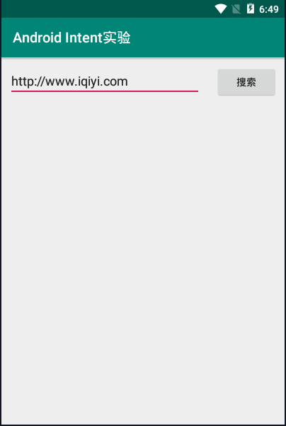
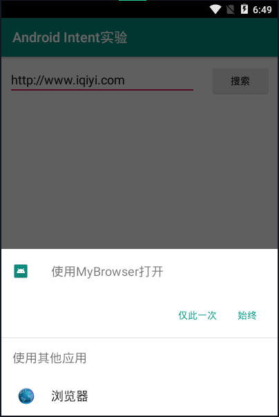
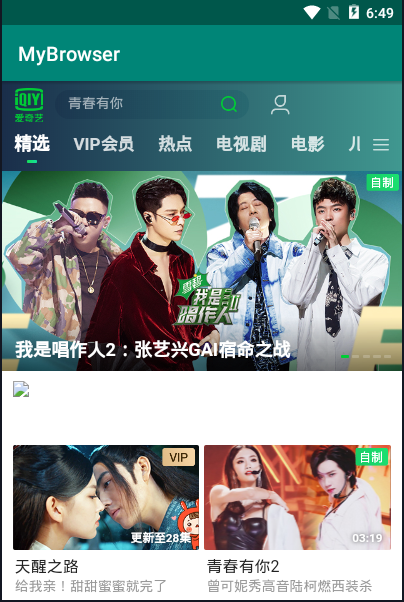

### Intent实验

#### 首先编写一个编辑框和一个按钮，水平放置这两个组件，如下图所示



#### 编写layout配置文件内容如下

```
<?xml version="1.0" encoding="utf-8"?>
<LinearLayout xmlns:android="http://schemas.android.com/apk/res/android"
    xmlns:tools="http://schemas.android.com/tools"
    android:layout_width="match_parent"
    android:layout_height="match_parent"
    tools:context=".MainActivity"
    android:orientation="horizontal">

 <EditText
    android:layout_width="wrap_content"
    android:layout_height="wrap_content"
    android:layout_weight="1"
    android:layout_margin="10dp"
    android:width="1dp"
    android:id="@+id/edit"
    android:hint="@string/edit"/>
 <Button
    android:layout_width="wrap_content"
    android:layout_height="wrap_content"
    android:layout_margin="10dp"
    android:id="@+id/search"
    android:text="@string/search"/>

</LinearLayout>
```

#### 编写MainActivity.java文件如下,实现发起网页浏览行为

    package com.example.myapplication;
    
    import androidx.appcompat.app.AppCompatActivity;
    import android.content.Intent;
    import android.net.Uri;
    import android.os.Bundle;
    import android.view.View;
    import android.widget.Button;
    import android.widget.EditText;
    
    public class MainActivity extends AppCompatActivity {
    
        EditText editUrl;
        Button btnBrowse;
    
        @Override
        protected void onCreate(Bundle savedInstanceState) {
            super.onCreate(savedInstanceState);
            setContentView(R.layout.activity_main);
    
            editUrl = findViewById(R.id.edit);
            btnBrowse = findViewById(R.id.search);
            btnBrowse.setOnClickListener(new View.OnClickListener() {
                @Override
                public void onClick(View view) {
                    Intent intent = new Intent();
                    String data = editUrl.getText().toString();
                    Uri uri = Uri.parse(data);
                    intent.setAction(Intent.ACTION_VIEW);
                    intent.setData(uri);
                    startActivity(intent);
                }
            });
        }
    }
#### 接着编写一个自定义浏览器，编写layout配置文件内容如下

```
<?xml version="1.0" encoding="utf-8"?>
<RelativeLayout xmlns:android="http://schemas.android.com/apk/res/android"
    xmlns:tools="http://schemas.android.com/tools"
    android:layout_width="match_parent"
    android:layout_height="match_parent"
    tools:context=".MainActivity">

    <WebView
        android:layout_width="match_parent"
        android:layout_height="match_parent"
        android:id="@+id/webView">
    </WebView>
</RelativeLayout>
```

#### 编写其java文件实现跳转网页功能

```
package com.example.myapplication;

import androidx.appcompat.app.AppCompatActivity;
import android.content.Intent;
import android.net.Uri;
import android.os.Bundle;
import android.webkit.WebSettings;
import android.webkit.WebView;
import android.webkit.WebViewClient;
import java.net.URL;

public class mybrowser extends AppCompatActivity {
    @Override
    protected void onCreate(Bundle savedInstanceState) {
        super.onCreate(savedInstanceState);
        setContentView(R.layout.activity);

        Intent intent = getIntent();
        Uri data = intent.getData();
        URL url = null;

        try {
            url = new URL(data.getScheme(), data.getHost(),data.getPath());
        } catch (Exception e) {
            e.printStackTrace();
        }
        startBrowser(url);
    }

    private void startBrowser(URL url) {
        WebView webView = (WebView) findViewById(R.id.webView);
        webView.loadUrl(url.toString());
        webView.setWebViewClient(new WebViewClient(){
            @Override
            public boolean shouldOverrideUrlLoading(WebView view, String url) {
                view.loadUrl(url);
                return true;
            }
        });
    }
}
```

#### 输入URL后，点击搜索，出现选择项选择浏览器，如下图所示



#### 这里我们选择自定义的浏览器，点击仅此一次，跳转到如下页面



#### 编写AndroidManifest.xml文件，编写内容如下

```
<?xml version="1.0" encoding="utf-8"?>
<manifest xmlns:android="http://schemas.android.com/apk/res/android"
    package="com.example.myapplication">

    <application
        android:allowBackup="true"
        android:icon="@mipmap/ic_launcher"
        android:label="@string/app_name"
        android:roundIcon="@mipmap/ic_launcher_round"
        android:supportsRtl="true"
        android:theme="@style/AppTheme">
        <activity android:name=".MainActivity">
            <intent-filter>
                <action android:name="android.intent.action.MAIN" />
    
                <category android:name="android.intent.category.LAUNCHER" />
            </intent-filter>
        </activity>
        <activity android:name=".mybrowser"
            android:label="@string/mybrowser_name">
            <intent-filter>
                <action android:name="android.intent.action.VIEW"/>
                <category android:name="android.intent.category.DEFAULT"/>
                <category android:name="android.intent.category.BROWSABLE"/>
                <data android:scheme="http"/>
                <data android:scheme="https"/>
            </intent-filter>
        </activity>
    
    </application>
    
    <uses-permission android:name="android.permission.INTERNET"/>

</manifest>
```

