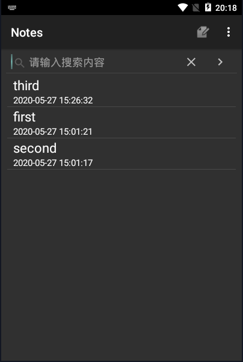
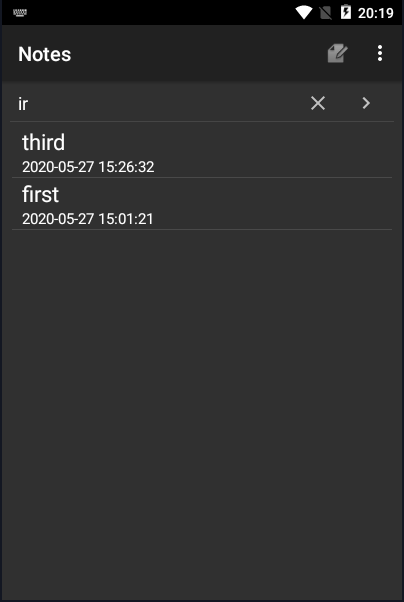

### NotePad期中实验

#### NoteList中显示条目增加时间戳显示

##### 1.首先先编写noteslist_item.xml文件，编写内容如下

```
<?xml version="1.0" encoding="utf-8"?>
<TableLayout xmlns:android="http://schemas.android.com/apk/res/android"
    android:layout_width="match_parent"
    android:layout_height="match_parent"
    android:stretchColumns="1">

<TableRow>
    <TextView
   		android:id="@android:id/text1"
    	android:layout_width="match_parent"
    	android:layout_height="match_parent"
    	android:textAppearance="?android:attr/textAppearanceLarge"
    	android:gravity="center_vertical"
    	android:paddingLeft="10dp"
    	android:singleLine="true"
    	android:layout_weight="1"
    	android:layout_margin="0dp"
    />
</TableRow>

<TableRow>
    <TextView
        android:id="@+id/text2"
        android:layout_width="match_parent"
        android:layout_height="match_parent"
        android:textAppearance="?android:attr/textAppearanceLarge"
        android:textSize="15dp"
        android:gravity="center_vertical"
        android:paddingLeft="10dip"
        android:singleLine="true"
        android:layout_weight="1"
        android:layout_margin="0dp"
    />

</TableRow>
</TableLayout>
```

##### 2.接着在NoteEditor.java中找到updateNote()这个函数，在getContentResolver().update前编写如下内容

        //添加时间戳
        Long now = Long.valueOf(System.currentTimeMillis());
        SimpleDateFormat sdFormatter = new SimpleDateFormat("yyyy-MM-dd HH:mm:ss");
        Date nowTime = new Date(now);
        String retStrFormatNowDate = sdFormatter.format(nowTime);
        values.put(NotePad.Notes.COLUMN_NAME_MODIFICATION_DATE, retStrFormatNowDate);
##### 3.然后在NoteList.java中改写以下内容

```
	// The columns needed by the cursor adapter
    private static final String[] PROJECTION = new String[] {
            NotePad.Notes._ID, // 0
            NotePad.Notes.COLUMN_NAME_TITLE, // 1
            NotePad.Notes.COLUMN_NAME_MODIFICATION_DATE, //从SQLite中读取修改时间的字段
    };
    //修改适配器内容，增加一个文本框来存放时间
    // The names of the cursor columns to display in the view, initialized to the title column
        String[] dataColumns = { NotePad.Notes.COLUMN_NAME_TITLE,NotePad.Notes.COLUMN_NAME_MODIFICATION_DATE } ;

    // The view IDs that will display the cursor columns, initialized to the TextView in
    // noteslist_item.xml
    int[] viewIDs = { android.R.id.text1,R.id.text2 };
```

##### 最后运行结果如下图所示



#### 添加笔记查询功能（根据标题查询）

##### 1.首先创建layout文件searchview.xml，编写内容如下

```
<?xml version="1.0" encoding="utf-8"?>
<LinearLayout xmlns:android="http://schemas.android.com/apk/res/android"
    android:layout_width="match_parent"
    android:layout_height="match_parent"
    android:orientation="vertical">
    <SearchView
        android:id="@+id/search2"
        android:layout_width="match_parent"
        android:layout_height="wrap_content"
        android:queryHint="请输入搜索内容"
        >
    </SearchView>
    <ListView
        android:paddingLeft="10dp"
        android:paddingRight="10dp"
        android:id="@android:id/list"
        android:layout_width="match_parent"
        android:layout_height="0dp"
        android:layout_weight="1"
        android:drawSelectorOnTop="false" />
    <TextView
        android:paddingLeft="10dp"
        android:paddingRight="10dp"
        android:id="@android:id/empty"
        android:gravity="center"
        android:layout_width="match_parent"
        android:layout_height="0dp"
        android:layout_weight="1"
        android:text="无搜索结果" />
</LinearLayout>
```

##### 2.接着在NodeList.java中创建SeachView()函数专门来配置SeachView实现查询功能，SeacrhView搜索是根据标题在数据库中进行模糊搜索并在ListView中即时显示，编写内容如下

    private void SearchView(final SimpleCursorAdapter adapter){
        SearchView searchView=findViewById(R.id.search2);
        //display submit button
        searchView.setSubmitButtonEnabled(true);
        //implement SearchView TextListener
        searchView.setOnQueryTextListener(new SearchView.OnQueryTextListener() {
            // when text has been submitted
            @Override
            public boolean onQueryTextSubmit(String s) {
                return false;
            }
            // when text is changing
            @Override
            public boolean onQueryTextChange(String s) {
                Cursor updatecursor;
                if(!s.equals("")){
                    String selection=NotePad.Notes.COLUMN_NAME_TITLE+" GLOB '*"+s+"*'";
                    //query selection condition
                    updatecursor = getContentResolver().query(
                            getIntent().getData(),            
                            // Use the default content URI for the provider.
                            PROJECTION,                       
                            // Return the note ID and title for each note.
                            selection,                             
                            // No where clause, return all records.
                            null,                             
                            // No where clause, therefore no where column values.
                            NotePad.Notes.DEFAULT_SORT_ORDER  
                            // Use the default sort order.
                    );
                }
                else {
                    updatecursor = getContentResolver().query(
                            getIntent().getData(),            
                            // Use the default content URI for the provider.
                            PROJECTION,                       
                            // Return the note ID and title for each note.
                            null,                             
                            // No where clause, return all records.
                            null,                             
                            // No where clause, therefore no where column values.
                            NotePad.Notes.DEFAULT_SORT_ORDER  
                            // Use the default sort order.
                    );
                }
                // change adapter from SimpleCursorAdapter cursor
                adapter.swapCursor(updatecursor);
                // adapter.notifyDataSetChanged();
                return true;
            }
        });
    }
##### 3.然后在NodeList.java中的onCreate()函数里设置成NotesList.java可以一开始直接加载该布局文件，紧接着调用 SearchView()函数

```
setContentView(R.layout.searchview);

 SearchView(adapter);
```

##### 最后运行结果如下图所示，在搜索框输入ir，可以查询到third与first这两个标题带有ir



##### 然后在搜索框输入fourth，发现找不到带有该字段的标题，并显示无搜索结果

