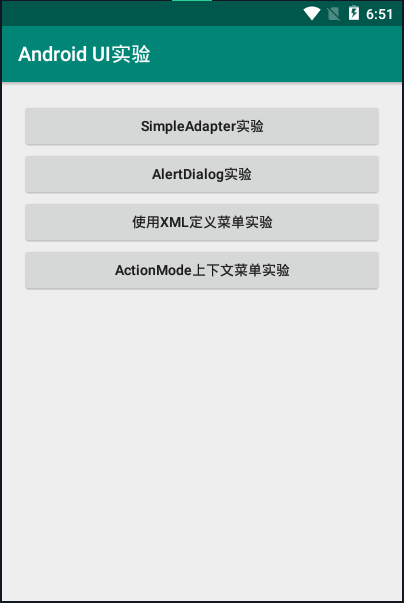
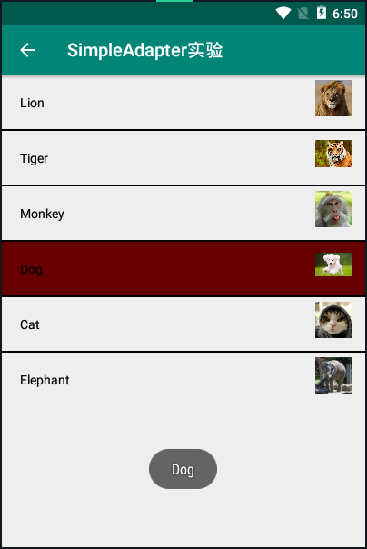
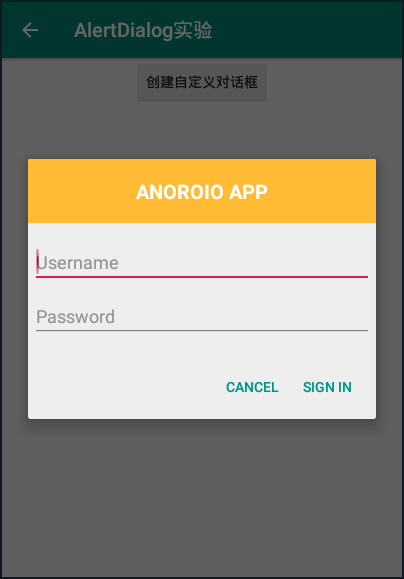
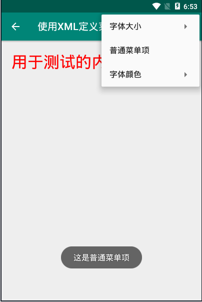
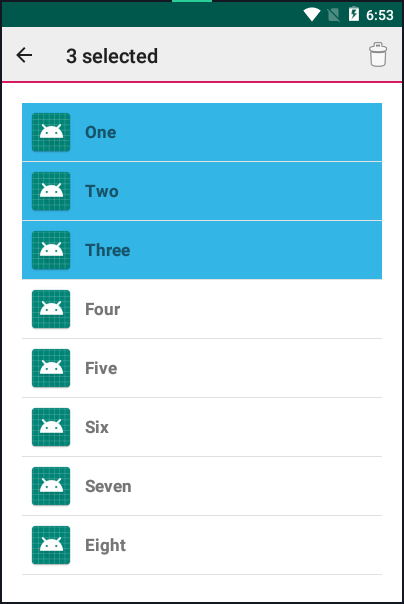

### UI组件实验

#### 首先在主活动上添加四个按钮用于管理实验



#### 编写activity_main配置文件内容如下

```
<?xml version="1.0" encoding="utf-8"?>
<LinearLayout xmlns:android="http://schemas.android.com/apk/res/android"
    xmlns:tools="http://schemas.android.com/tools"
    android:layout_width="match_parent"
    android:layout_height="match_parent"
    tools:context=".MainActivity"
    android:paddingBottom="@dimen/activity_vertical_margin"
    android:paddingLeft="@dimen/activity_horizontal_margin"
    android:paddingRight="@dimen/activity_horizontal_margin"
    android:paddingTop="@dimen/activity_vertical_margin"
    android:orientation="vertical">

    <Button
        android:layout_width="match_parent"
        android:layout_height="wrap_content"
        android:id="@+id/simple_adapter_btn"
        android:text="@string/simple_adapter"
        android:textAllCaps="false"/>
    <Button
        android:layout_width="match_parent"
        android:layout_height="wrap_content"
        android:id="@+id/custom_dialog"
        android:text="@string/alert_dialog"
        android:textAllCaps="false"/>
    <Button
        android:layout_width="match_parent"
        android:layout_height="wrap_content"
        android:id="@+id/xml_menu_btn"
        android:text="@string/xml_define_menu"
        android:textAllCaps="false"/>
    <Button
        android:layout_width="match_parent"
        android:layout_height="wrap_content"
        android:id="@+id/action_context_btn"
        android:text="@string/action_mode"
        android:textAllCaps="false"/>

</LinearLayout>
```

#### 编写AndroidManifest.xml文件，编写内容如下

```
<?xml version="1.0" encoding="utf-8"?>
<manifest xmlns:android="http://schemas.android.com/apk/res/android"
    package="com.example.myapplication">

    <application
        android:allowBackup="true"
        android:icon="@mipmap/ic_launcher"
        android:label="@string/app_name"
        android:roundIcon="@mipmap/ic_launcher_round"
        android:supportsRtl="true"
        android:theme="@style/AppTheme">
        <activity android:name=".MainActivity">
            <intent-filter>
                <action android:name="android.intent.action.MAIN" />
    
                <category android:name="android.intent.category.LAUNCHER" />
            </intent-filter>
        </activity>
        <activity android:label="@string/simple_adapter"
            android:parentActivityName=".MainActivity"
            android:name=".Simple_Adapter" />
        <activity android:label="@string/alert_dialog"
            android:parentActivityName=".MainActivity"
            android:name=".Alert_Dialog" />
        <activity android:label="@string/action_mode"
            android:name=".Action_Mode" />
        <activity android:label="@string/xml_define_menu"
            android:parentActivityName=".MainActivity"
            android:name=".XMLDefineMenu">
        </activity>
    </application>

</manifest>
```

#### 编写MainActivity.java文件实现点击跳转事件

```
package com.example.myapplication;

import androidx.appcompat.app.AppCompatActivity;
import android.content.Intent;
import android.os.Bundle;
import android.view.View;
import android.widget.Button;

public class MainActivity extends AppCompatActivity {

    @Override
    protected void onCreate(Bundle savedInstanceState) {
        super.onCreate(savedInstanceState);
        setContentView(R.layout.activity_main);

        Button btn_simpleadapter = findViewById(R.id.simple_adapter_btn);
        btn_simpleadapter.setOnClickListener(new View.OnClickListener() {
            @Override
            public void onClick(View view) {
                Intent intent = new Intent(MainActivity.this, Simple_Adapter.class);
                startActivity(intent);
            }
        });

        Button btn_custom_dialog = findViewById(R.id.custom_dialog);
        btn_custom_dialog.setOnClickListener(new View.OnClickListener() {
            @Override
            public void onClick(View view) {
                Intent intent = new Intent(MainActivity.this, Alert_Dialog.class);
                startActivity(intent);
            }
        });

        Button btn_xml_menu = findViewById(R.id.xml_menu_btn);
        btn_xml_menu.setOnClickListener(new View.OnClickListener() {
            @Override
            public void onClick(View view) {
                Intent intent = new Intent(MainActivity.this, XMLDefineMenu.class);
                startActivity(intent);
            }
        });

        Button btn_action_context = (Button)findViewById(R.id.action_context_btn);
        btn_action_context.setOnClickListener(new View.OnClickListener() {
            @Override
            public void onClick(View view) {
                Intent intent = new Intent(MainActivity.this, Action_Mode.class);
                startActivity(intent);
            }
        });
    }
}

```

#### 当我们点击SimpleAdapter实验时会跳转到如下页面，接着点击Dog，下方会出现Dog



#### 编写layout配置文件内容如下

```
<RelativeLayout xmlns:android="http://schemas.android.com/apk/res/android"
    xmlns:tools="http://schemas.android.com/tools"
    android:layout_width="match_parent"
    android:layout_height="match_parent"
    tools:context=".Simple_Adapter">

    <ListView
        android:id="@+id/simpleListView"
        android:layout_width="match_parent"
        android:layout_height="wrap_content"
        android:divider="#000"
        android:dividerHeight="2dp"
        android:listSelector="#600"/>


</RelativeLayout>
```

#### 接下来在相应的Activity.java文件中编写相关内容

```
package com.example.myapplication;

import android.os.Bundle;
import android.view.Menu;
import android.view.MenuItem;
import android.view.View;
import android.widget.AdapterView;
import android.widget.ListView;
import android.widget.Toast;
import androidx.appcompat.app.AppCompatActivity;
import java.util.ArrayList;
import java.util.HashMap;

public class Simple_Adapter extends AppCompatActivity {

    ListView simpleListView;
    String[] animalName={"Lion","Tiger","Monkey","Dog","Cat","Elephant"};
    int[] animalImages={R.drawable.lion,R.drawable.tiger,R.drawable.monkey,R.drawable.dog,R.drawable.cat,R.drawable.elephant};

    protected void onCreate(Bundle savedInstanceState) {
        super.onCreate(savedInstanceState);
        setContentView(R.layout.simple_adapter);
        getSupportActionBar().setDisplayHomeAsUpEnabled(true);
        simpleListView=findViewById(R.id.simpleListView);

        ArrayList<HashMap<String,String>> arrayList=new ArrayList<>();
        for (int i=0;i<animalName.length;i++)
        {
            HashMap<String,String> hashMap=new HashMap<>();
            hashMap.put("name",animalName[i]);
            hashMap.put("image",animalImages[i]+"");
            arrayList.add(hashMap);
        }
        String[] from={"name","image"};
        int[] to={R.id.textView,R.id.imageView};
        android.widget.SimpleAdapter simpleAdapter=new android.widget.SimpleAdapter(this,arrayList,R.layout.list_view_items,from,to);
        simpleListView.setAdapter(simpleAdapter);

        simpleListView.setOnItemClickListener(new AdapterView.OnItemClickListener() {
            @Override
            public void onItemClick(AdapterView<?> adapterView, View view, int i, long l) {
                Toast.makeText(getApplicationContext(),animalName[i],Toast.LENGTH_LONG).show();
            }
        });
    }

}

```

#### 当我们点击创建自定义对话框按钮时，将出现如下页面



#### 编写layout配置文件内容如下

```
<?xml version="1.0" encoding="utf-8"?>
<LinearLayout xmlns:android="http://schemas.android.com/apk/res/android"
    android:orientation="vertical"
    android:layout_width="wrap_content"
    android:layout_height="wrap_content">
    <TextView
        android:text="@string/anoroio_app"
        android:gravity="center"
        android:textSize="20sp"
        android:textColor="@color/white"
        android:textStyle="bold"
        android:layout_width="match_parent"
        android:layout_height="64dp"
        android:scaleType="center"
        android:background="#FFFFBB33"
        android:contentDescription="@string/app_name" />
    <EditText
        android:id="@+id/username"
        android:inputType="textEmailAddress"
        android:layout_width="match_parent"
        android:layout_height="wrap_content"
        android:layout_marginTop="16dp"
        android:layout_marginLeft="4dp"
        android:layout_marginRight="4dp"
        android:layout_marginBottom="4dp"
        android:hint="@string/username" />
    <EditText
        android:id="@+id/password"
        android:inputType="textPassword"
        android:layout_width="match_parent"
        android:layout_height="wrap_content"
        android:layout_marginTop="4dp"
        android:layout_marginLeft="4dp"
        android:layout_marginRight="4dp"
        android:layout_marginBottom="16dp"
        android:fontFamily="sans-serif"
        android:hint="@string/password"/>
</LinearLayout>
```

#### 编写相应的Java文件，内容如下

```
package com.example.myapplication;

import androidx.appcompat.app.AppCompatActivity;

import android.content.DialogInterface;
import android.os.Bundle;
import android.view.LayoutInflater;
import android.view.View;
import android.widget.Button;

public class Alert_Dialog extends AppCompatActivity {


    @Override
    protected void onCreate(Bundle savedInstanceState) {
        super.onCreate(savedInstanceState);
        setContentView(R.layout.activity_dialog);
        getSupportActionBar().setDisplayHomeAsUpEnabled(true);
        Button btn_custom_dialog = (Button)findViewById(R.id.custom_dialog_btn);
        btn_custom_dialog.setOnClickListener(new View.OnClickListener() {
            @Override
            public void onClick(View view) {
                createDialog();
            }
        });
    }
    
    public void createDialog() {
        android.app.AlertDialog.Builder builder = new android.app.AlertDialog.Builder(this);
        // Get the layout inflater
        LayoutInflater inflater = getLayoutInflater();
    
        // Inflate and set the layout for the dialog
        // Pass null as the parent view because its going in the dialog layout
        builder.setView(inflater.inflate(R.layout.alert_dialog, null))
                // Add action_mode buttons
                .setPositiveButton(R.string.signin, new DialogInterface.OnClickListener() {
                    @Override
                    public void onClick(DialogInterface dialog, int id) {
                        // sign in the user ...
                    }
                })
                .setNegativeButton(R.string.cancel, new DialogInterface.OnClickListener() {
                    public void onClick(DialogInterface dialog, int id) {
                        //LoginDialogFragment.this.getDialog().cancel();
                    }
                });
        builder.create();
        builder.show();
    }

}
```

#### 点击右上角进行选择字体颜色(红色)、字体大小(中号)会出现如下页面



#### 编写layout配置文件内容如下

```
<?xml version="1.0" encoding="utf-8"?>
<RelativeLayout xmlns:android="http://schemas.android.com/apk/res/android"
    xmlns:tools="http://schemas.android.com/tools"
    android:layout_width="match_parent"
    android:layout_height="match_parent"
    android:paddingBottom="@dimen/activity_vertical_margin"
    android:paddingLeft="@dimen/activity_horizontal_margin"
    android:paddingRight="@dimen/activity_horizontal_margin"
    android:paddingTop="@dimen/activity_vertical_margin"
    tools:context="com.example.myapplication.XMLDefineMenu">

    <TextView
        android:layout_width="match_parent"
        android:layout_height="wrap_content"
        android:id="@+id/tv_test"
        android:text="@string/tv_test"/>

</RelativeLayout>
```

#### 编写相应的Java文件，内容如下

```
package com.example.myapplication;

import androidx.appcompat.app.AppCompatActivity;
import android.graphics.Color;
import android.os.Bundle;
import android.view.Menu;
import android.view.MenuItem;
import android.widget.TextView;
import android.widget.Toast;

public class XMLDefineMenu extends AppCompatActivity {
    TextView tv_test;

    @Override
    protected void onCreate(Bundle savedInstanceState) {
        super.onCreate(savedInstanceState);
        setContentView(R.layout.xml_define_menu);
        tv_test = (TextView) findViewById(R.id.tv_test);
        getSupportActionBar().setDisplayHomeAsUpEnabled(true);
    }
    
    @Override
    public boolean onCreateOptionsMenu(Menu menu) {
        this.getMenuInflater().inflate(R.menu.menu_settings, menu);
        return true;
    }
    
    @Override
    public boolean onOptionsItemSelected(MenuItem item) {
        switch (item.getItemId()) {
            case R.id.menu_font_small:
                tv_test.setTextSize(10*2);
                break;
            case R.id.menu_font_middle:
                tv_test.setTextSize(16*2);
                break;
            case R.id.menu_font_big:
                tv_test.setTextSize(20*2);
                break;
            case R.id.menu_normal:
                Toast.makeText(XMLDefineMenu.this, "这是普通菜单项", Toast.LENGTH_SHORT).show();
                break;
            case R.id.menu_color_red:
                tv_test.setTextColor(Color.RED);
                break;
            case R.id.menu_color_black:
                tv_test.setTextColor(Color.BLACK);
                break;
        }
        return true;
    }

}
```

长按任意组件，进行选择，出现如下页面



#### 编写layout配置文件内容如下

```
<RelativeLayout xmlns:android="http://schemas.android.com/apk/res/android"
    xmlns:tools="http://schemas.android.com/tools"
    android:layout_width="match_parent"
    android:layout_height="match_parent"
    android:paddingBottom="@dimen/activity_vertical_margin"
    android:paddingLeft="@dimen/activity_horizontal_margin"
    android:paddingRight="@dimen/activity_horizontal_margin"
    android:paddingTop="@dimen/activity_vertical_margin"
    tools:context=".Action_Mode"
    android:background="@android:color/background_light" >

    <ListView
        android:id="@android:id/list"
        android:layout_width="match_parent"
        android:layout_height="wrap_content"
        android:layout_centerVertical="true"
        android:choiceMode="multipleChoice">
    </ListView>

</RelativeLayout>
```

#### 编写相应的Java文件，内容如下

```
package com.example.myapplication;

import android.app.ListActivity;
import android.content.Context;
import android.os.Bundle;
import android.view.Menu;
import android.view.MenuInflater;
import android.view.MenuItem;
import android.view.View;
import android.view.ViewGroup;
import android.widget.AbsListView;
import android.widget.AdapterView;
import android.widget.ArrayAdapter;
import android.widget.ListView;
import java.util.HashMap;
import java.util.Set;

public class Action_Mode extends ListActivity {

    private String[] data = {"One", "Two", "Three", "Four", "Five", "Six", "Seven", "Eight", "Nine","Ten"};
    
    private SelectionAdapter mAdapter;
    
    @Override
    protected void onCreate(Bundle savedInstanceState) {
        super.onCreate(savedInstanceState);
        setContentView(R.layout.action_mode);
        mAdapter = new SelectionAdapter(this,
                R.layout.row_list_item, R.id.textView1, data);
        setListAdapter(mAdapter);
        getListView().setChoiceMode(ListView.CHOICE_MODE_MULTIPLE_MODAL);
    
        getListView().setMultiChoiceModeListener(new AbsListView.MultiChoiceModeListener() {
    
            private int nr = 0;
    
            @Override
            public boolean onPrepareActionMode(android.view.ActionMode mode, Menu menu) {
                return false;
            }
    
            @Override
            public void onDestroyActionMode(android.view.ActionMode mode) {
                mAdapter.clearSelection();
            }
    
            @Override
            public boolean onCreateActionMode(android.view.ActionMode mode, Menu menu) {
                nr = 0;
                MenuInflater inflater = getMenuInflater();
                inflater.inflate(R.menu.action_mode_delete, menu);
                return true;
            }
    
            @Override
            public boolean onActionItemClicked(android.view.ActionMode mode, MenuItem item) {
                switch (item.getItemId()) {
                    case R.id.item_delete:
                        nr = 0;
                        mAdapter.clearSelection();
                        mode.finish();
                }
                return false;
            }
    
            @Override
            public void onItemCheckedStateChanged(android.view.ActionMode mode, int position,
                                                  long id, boolean checked) {
                if (checked) {
                    nr++;
                    mAdapter.setNewSelection(position, checked);
                } else {
                    nr--;
                    mAdapter.removeSelection(position);
                }
                mode.setTitle(nr + " selected");
    
            }
        });
    
        getListView().setOnItemLongClickListener(new AdapterView.OnItemLongClickListener() {
            @Override
            public boolean onItemLongClick(AdapterView<?> arg0, View arg1,
                                           int position, long arg3) {
                getListView().setItemChecked(position, !mAdapter.isPositionChecked(position));
                return false;
            }
        });
    }
    
    private class SelectionAdapter extends ArrayAdapter<String> {
    
        private HashMap<Integer, Boolean> mSelection = new HashMap<Integer, Boolean>();
        public SelectionAdapter(Context context, int resource,
                                int textViewResourceId, String[] objects) {
            super(context, resource, textViewResourceId, objects);
        }
    
        public void setNewSelection(int position, boolean value) {
            mSelection.put(position, value);
            notifyDataSetChanged();
        }
    
        public boolean isPositionChecked(int position) {
            Boolean result = mSelection.get(position);
            return result == null ? false : result;
        }
    
        public Set<Integer> getCurrentCheckedPosition() {
            return mSelection.keySet();
        }
    
        public void removeSelection(int position) {
            mSelection.remove(position);
            notifyDataSetChanged();
        }
    
        public void clearSelection() {
            mSelection = new HashMap<Integer, Boolean>();
            notifyDataSetChanged();
        }
    
        @Override
        public View getView(int position, View convertView, ViewGroup parent) {
            View v = super.getView(position, convertView, parent);
            v.setBackgroundColor(getResources().getColor(android.R.color.background_light)); 
            if (mSelection.get(position) != null) {
              v.setBackgroundColor(getResources().getColor(android.R.color.holo_blue_light));
            }
            return v;
        }
    }

}
```

